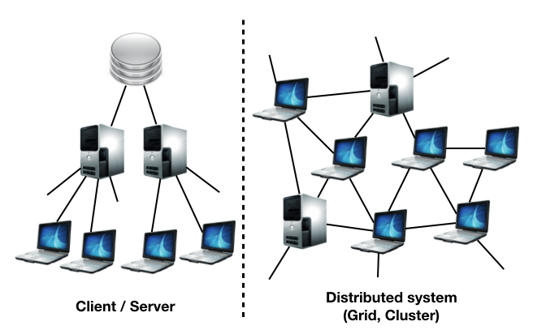
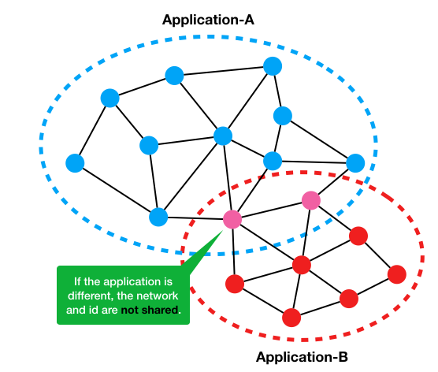

# System concept

Colonio is an open source library, to provide distributed system features for your system using WebRTC peer to peer network.

You can develop a system by using some distributed algorithm in a native environment and in the web frontend. Applications can communicate with each other even if it is developed by different program language or run on different environment. Because Colonio's core system is developed by the common program code and export it for each environment.

By using distributed algorithms in client or frontend side, You can utilize clients resource instead of server resource, for example, network and storage.
You can develop services that are difficult to scale with server resources alone.
By combining with the client / server model, there is a possibility to reduce its cost.

# System structure
Your applications that using Colonio was launched, are connected to each other to create a communication network. In that network, there is a seed (server) for sign-in and distributing setting information, but signaling and data sharing, etc. are realized through nodes (client) without using a seed.

The network is based on WebRTC and can be used even if there are mixed platforms (Web / Native application).

The network is separated by each application, and data is not shared with another application.

# Algorithms
## Distributed KVS (Key Value Store)
KVS is a data structure commonly known as a dictionary or hash and keeps data distributed on nodes.
KVS is a mechanism suitable for sharing data to be rewritten between nodes.

## Location-based PubSub

PubSub is one type of messaging model. When the Publisher sends a message, the message is propagated to the Subscriber.
In location-based PubSub, it is easy to use a function such as sending a message to Subscriber within a certain range from Publisher.
The position of the node can be used two-dimensional coordinates such as actual position (latitude, longitude), game map or torus tube.

# How to use
* Setup Colonio server and configure it as seed. And setup STUN, TURN server (WebRTC relay server) as needed to improve node's connectivity.
* Develop client with Colonio library as node.
