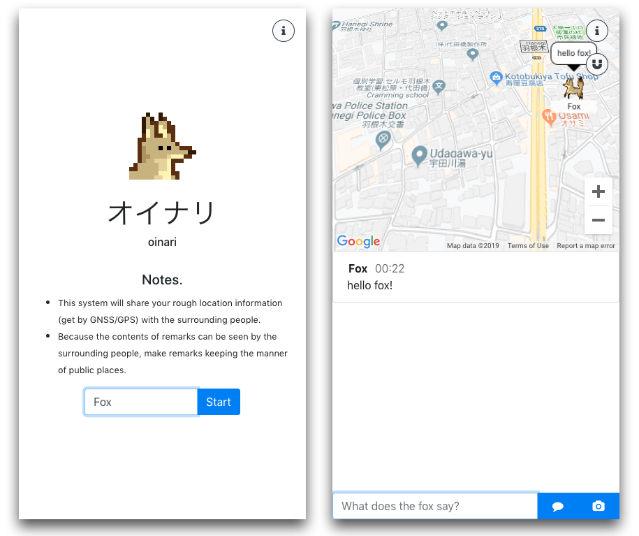

# Oinari
### [www.oinari.app](https://www.oinari.app/)

Oinari(オイナリ) is the demonstration project of the distributed algorithm library Colonio. In this program, by connecting users' browsers and collaborating with each other, it is possible to diffuse the data with little use of the server.